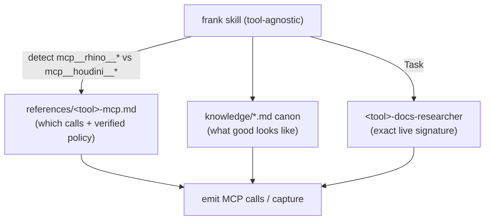
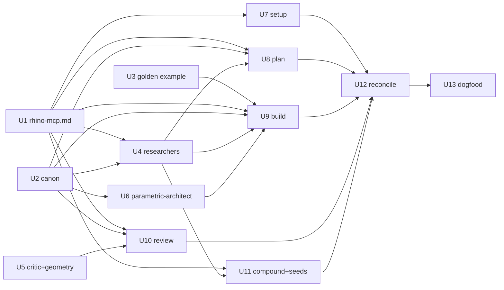

# feat: frank skill spine — author the 5 skills, 6 agents, and hybrid knowledge canon

**Target repo:** `frank` (`~/Documents/projects/frank`). All paths below are frank-relative.

## Summary

Author the actual substance of the `frank` Claude Code plugin: the **5 workflow skills** (`frank-setup`, `frank-plan`, `frank-build`, `frank-review`, `frank-compound`), the **6 agents** (`silhouette-critic`, `geometry-reviewer`, `parametric-architect`, `rhino-docs-researcher`, `houdini-docs-researcher`, `learnings-researcher`), and a **hybrid knowledge canon** (`parametric-scripting.md` + `verification.md` authored with citations; `geometry-quality.md` + `fabrication.md` as labeled stubs). It also authors the one missing reference pack (`references/rhino-mcp.md`), the golden Rhino example, seeds three Rhino learnings, and reconciles the README/manifest to the shipped surface.

The plugin is modeled file-for-file on the installed `compound-engineering` (CE) 3.8.1 plugin — frank is the 3D-modeling analog of CE's software-engineering spine. The skills are written **tool-agnostic** and dispatch to whichever modeling MCP is connected (`mcp__rhino__*` or `mcp__houdini__*`) by STOP-gate-loading the matching `references/<tool>-mcp.md` pack. Both tool tracks are now **proven** this session — the Houdini MCP was wired up, hardened, and validated end-to-end; the Rhino track is grounded by the spiral-ribbon-sculpture project.

**Origin document:** `docs/plan.md` (the full design spec — knowledge architecture, target file tree, M0–M7 milestones). This plan executes M1–M5 of it; M6 (Houdini) is effectively complete and M7 (distribution) follows.

> **A note on "tests":** frank's skills and agents are markdown instruction files; there is no unit-test runner for them. Throughout this plan, **Test scenarios** are concrete **behavioral verification assertions** — given a stated input/context, the skill or agent should produce a stated observable behavior (correct dispatch, correct reference load, correct refusal, correct artifact). The real integration test is **U13 (dogfood)**, which runs the full `/frank-setup → /frank-plan → /frank-build → /frank-review` loop against a live Rhino document. This mirrors the spiral plan's discipline (the modeling medium has no test runner; verification is geometric/visual/behavioral assertion).

---

## Problem Frame

`frank` currently has a solid foundation — a valid manifest, README, the full `docs/plan.md` spec, a validated `references/houdini-mcp.md`, setup docs, and two Houdini seed learnings — but **zero authored skills, agents, or canon**. It is not yet an installable, usable plugin; it is scaffolding plus one proven tool track's reference material. This plan turns the scaffolding into the working product: the slash commands people actually install and the agents those commands spawn, grounded in CE's proven authoring conventions and frank's own proven Rhino/Houdini policies.

---

## Requirements

Tracing to `docs/plan.md` R1–R7 (see origin) plus decisions made for this phase:

- **R1.** All five skills load as slash commands and all six agents [this phase] resolve by `subagent_type` (= each agent's frank-prefixed frontmatter `name` = filename stem) — i.e., the plugin is installable and its components wire together. The 7th agent (`frank-fabrication-reviewer`) is deferred to M5. "Bare name" means no path namespace, not the prefix stripped. *(origin R1, R2, R3)*
- **R2.** Skills are **tool-agnostic**: each detects the active MCP family and STOP-gate-loads the matching `references/<tool>-mcp.md` pack; no skill hardcodes Rhino-only or Houdini-only calls. *(new — enables both proven tracks from one spine)*
- **R3.** The **3-layer knowledge architecture** is realized: Canon (`knowledge/*.md`, durable craft), Reference packs (`references/<tool>-mcp.md`, volatile API + verified policy), Researcher agents (Layer-2 live API grounding). *(origin R4)*
- **R4.** Knowledge canon is **hybrid**: `parametric-scripting.md` + `verification.md` authored with citations; `geometry-quality.md` + `fabrication.md` are self-describing labeled stubs (so STOP-gate loads resolve to something). *(user decision, 2026-06-01)*
- **R5.** `frank-build` emits generators that are **idempotent, scope-isolated, re-runnable, and driven by a named parameter block** — encoding the proven Rhino layer-helper contract and Houdini subnet-rebuild contract. *(origin R6)*
- **R6.** `frank-review` runs a **capture → compare → adjust** loop with a pinned/recorded camera, human acceptance authority, and an iteration cap; it dispatches the reviewer agents and merges their JSON findings. *(origin R7)*
- **R7.** The proven Houdini policies are encoded as **hard rules**: `render_single_view` only (`render_quad_views` BANNED), read renders from disk (not inline base64), clean MCP scaffolding nodes, own-named-subnet scope isolation. *(this session's hardening; `docs/solutions/2026-06-01_houdini-mcp-render-deadlock.md`)*
- **R8.** `frank-compound` writes a learning to `docs/solutions/` using the existing frontmatter schema; `frank-learnings-researcher` retrieves them; the three Rhino spiral learnings are seeded. *(origin Layer 3)*
- **R9.** Reviewer agents (`frank-silhouette-critic`, `frank-geometry-reviewer`) and `frank-review` share **one pinned JSON findings contract** — envelope `{reviewer, findings, residual_risks, testing_gaps}` written to `/tmp/frank/frank-review/$RUN_ID/<reviewer>.json`, where `frank-review` generates `RUN_ID` and passes it into each reviewer's payload — so the merge step works. *(risk-driven)*
- **R10.** `README.md` and `docs/plan.md` are reconciled to the **shipped surface** (6 agents, hybrid canon), so the docs don't lie about what installs.

---

## Scope Boundaries

- **In scope:** authoring the 5 skills, 6 agents, hybrid canon (2 authored + 2 stubbed), `references/rhino-mcp.md`, the golden Rhino example, 3 seed Rhino learnings, README/manifest reconciliation, and a dogfood validation pass.
- **Not** authoring new MCP integrations — both tool MCPs exist and are proven.
- **Not** building a marketplace listing or `CHANGELOG` release process beyond a stub (M7).
- **Not** re-validating the Houdini server hardening — done and documented this session.

### Deferred to Follow-Up Work

- **`frank-fabrication-reviewer` agent + full `fabrication.md` canon** — M5; this plan ships `fabrication.md` as a stub and omits the 7th agent. (`README.md`/`plan.md` reference a 7th agent today; U12 reconciles that.)
- **Marketplace publishing** (`marketplace.json`, release `CHANGELOG`) — M7.
- **Live Houdini dogfood** — the Houdini half of U13 requires Rob to connect `mcp__houdini__*` to the session; the Rhino spine is the validated critical path, Houdini live-validation is a follow-on.
- **`geometry-quality.md` full authoring** — stubbed now, grow via compounding.

---

## Context & Research

*(Consolidated from the `frank-skill-spine-research` workflow — CE skill/agent conventions, frank state, proven policies. See origin `docs/plan.md` for the upstream architecture.)*

### CE authoring conventions frank mirrors

- **Skills:** `skills/<name>/SKILL.md` + sibling `references/`. Frontmatter `name` (= dir name), `description` (formula: *what it does. Use when '<trigger phrases>'.*), optional `argument-hint`, `disable-model-invocation: true` (only `frank-setup`). Body = cross-cutting H2 policy sections first (`## Interaction Method` copied verbatim, `## Core Principles`, `## When to Use`, `## Quality Bar`), then `## Workflow` with `### Phase N`/`#### N.1` (plan/build/compound) or `### Stage N` (review).
- **Reference loading:** lazy, on-demand, relative paths only. Load-bearing loads use the **STOP-gate** idiom (`**STOP. Before <action>, read references/X.md.** <consequence>.`). Never bulk-load at skill start. `${CLAUDE_PLUGIN_ROOT}` is reserved for harness detection in `frank-setup` only.
- **Agent dispatch:** by **bare name** via `Task <agent-name>(<context>)` (the name is the `subagent_type`); parallel agents in a `Run these agents in parallel:` bulleted list; override model only at the dispatch site; always omit the `mode` parameter.
- **Agents:** `agents/<prefix>-<role>.agent.md`. Frontmatter `name`, `description`, `model: inherit` (always; skill overrides at dispatch), `tools` (comma-separated). Body opens `**Note: The current year is 2026.**` + a `You are…` persona. **Template A "Structured Reviewer"** (JSON output, `## What you're hunting for`, `## Confidence calibration` anchors, `## What you don't flag` lane discipline) for `silhouette-critic`/`geometry-reviewer`. **Template B "Prose Analyst"** (numbered framework, Markdown report) for `parametric-architect` and the three researchers (+ ordered search protocol, epistemic-humility clause, `## Integration Points`).
- **Tool grants:** baseline `Read, Grep, Glob, Bash`; external researchers add `WebFetch, WebSearch` + the `mcp__<tool>__*` wildcard; geometry-judging reviewers get **read-only** MCP inspect/capture tools (`capture_viewport`/`get_object_info`/`get_scene_info`) but **not** creation/boolean tools; `Write` only on a JSON-artifact-emitting reviewer; never `Edit`/`Task` on a subagent.

### frank current state

- **Real:** `.claude-plugin/plugin.json`, `README.md`, `docs/plan.md`, `references/houdini-mcp.md` (validated), `docs/houdini-setup.md`, two Houdini learnings in `docs/solutions/`, `LICENSE`, `.gitignore`.
- **Empty/greenfield:** all of `skills/*`, `agents/` (0 of 6), `knowledge/` (0 of 4), `examples/rhino/`.
- **Missing (named in plan):** `references/rhino-mcp.md`, `CHANGELOG.md`, `marketplace.json`.

### Proven policies to encode (validated this session / grounded by the spiral project)

- **Rhino:** one named `P = {...}` block, no magic numbers; three idempotent **layer** helpers (`_ensure_layer`, `_clear_layer` deleting only `rs.ObjectsByLayer(name)`, `_to_layer`); **foreign-layer object-count invariant** (identical before/after every run); live primitive introspection before writing code; capture→compare→adjust with a **pinned/recorded camera**; geometric guards that **WARN not emit** (self-overlap, bbox/scale, per-layer counts); `try/finally` transient cleanup. Capture = `capture_viewport` (returns inline — simpler than Houdini, no quad/scaffolding problem) but still mandate pinned-camera discipline.
- **Houdini (validated live 2026-06-01):** `render_single_view` ONLY (`render_quad_views` BANNED — quad stacks four unbounded main-thread OpenGL ROP renders, which wedged the server pre-hardening); **read the render from disk** (`Read` the `render_path` file, not the ~56 KB inline `image_base64`); expect+clean scaffolding nodes (`/obj/MCP_CAMERA`, `/obj/MCP_CAM_CENTER`, `/out/MCP_OGL_RENDER`); own-named-**subnet** scope isolation; errors surface cleanly so `frank-build` self-corrects; Houdini is unitless (~1 unit = 1 m). See `docs/solutions/2026-06-01_houdini-mcp-render-deadlock.md`.

### Institutional learnings already on record

`docs/solutions/2026-06-01_houdini-mcp-render-deadlock.md` and `…_houdini-mcp-setup-gotchas.md`. The three Rhino learnings (sweep1 framing-twist, knotstyle-overshoot-vs-kink, adjacent-turn self-intersection) exist only as prose in the spiral plan and are seeded here by U11.

---

## Key Technical Decisions

- **Tool-agnostic skills + per-tool reference packs (not per-tool skills).** One spine that detects the connected MCP family and STOP-gate-loads `references/<tool>-mcp.md`. Rationale: avoids 2× skill duplication, makes the plan→build→review discipline identical across tools, and extends to a third tool (Blender) by adding only a reference pack + researcher. The reference pack is the *only* place tool-specific calls/policies live.
- **MCP-family detection — the dispatch primitive, distinct from harness detection.** A skill determines the connected family by inspecting which `mcp__rhino__*` vs `mcp__houdini__*` tools are present in its available toolset (Claude Code surfaces connected MCP servers' tools; deferred ones appear by name and load via `ToolSearch`), then **confirms** by issuing that family's survey call (`get_document_summary` for Rhino / `get_scene_info` for Houdini) — a successful response proves a live, responsive connection. **Both present →** `AskUserQuestion` to pick the target. **Neither →** halt with the relevant setup pointer (`docs/houdini-setup.md` / Rhino MCP setup). This is **separate from and sequenced after** `${CLAUDE_PLUGIN_ROOT}` harness detection in `frank-setup` (harness ≠ connected MCP). `frank-setup` records the chosen family; `frank-build`/`frank-review` re-detect or read the record.
- **Agent identity is one string, frank-prefixed.** Every agent's frontmatter `name`, its filename stem, and its dispatch `subagent_type` are **identical and frank-prefixed** (e.g. `frank-silhouette-critic`). "Bare name" in dispatch means *no path namespace*, not the prefix stripped — always `Task frank-silhouette-critic(...)`, never `Task silhouette-critic(...)`. A mismatch silently breaks dispatch and the review JSON merge.
- **Three-source division of labor inside every skill.** Canon (`knowledge/*.md`) = *what good looks like*; reference pack = *which calls + which verified policies on this tool*; researcher agent = *the exact current signature, confirmed live*. This is what keeps canon free of volatile API (Layer 2 grounding) and is the core of R3.
- **Hybrid canon.** `parametric-scripting.md` + `verification.md` are the two the skills lean on hardest, so they're authored with citations now; `geometry-quality.md` + `fabrication.md` are **self-describing stubs** (heading skeleton + scope note + "not yet authored") so STOP-gate loads resolve to real orientation, not emptiness. *(user decision)*
- **Reviewers receive captures as files, not MCP grants.** `frank-review` performs the capture (it holds the MCP) and writes the image to a path, then passes that path to the reviewers. `frank-silhouette-critic` + `frank-geometry-reviewer` are granted only `Read, Grep, Glob, Bash` (+ `Write` for the JSON artifact) — **no MCP tools**. Rationale: CE never grants read-only MCP subsets (`tools:` honors only `mcp__server__*` wildcards, which would also grant create/boolean), so a read-only-subset safety model is unenforceable; passing already-written capture files keeps reviewers structurally incapable of mutating geometry and matches how CE reviewers actually work.
- **Reviewer JSON + RUN_ID lifecycle (pinned once in U5, consumed in U10).** `frank-review` generates `RUN_ID=$(date +%Y%m%d-%H%M%S)-$(head -c4 /dev/urandom | od -An -tx1 | tr -d ' ')` **before** dispatch and passes it as a named field in each reviewer's Task payload (alongside the capture path + reference path). Each reviewer writes `{"reviewer", "findings", "residual_risks", "testing_gaps"}` to `/tmp/frank/frank-review/$RUN_ID/<reviewer>.json`. After both complete, `frank-review` reads that `$RUN_ID` dir and merges/dedups; an **absent artifact** (reviewer errored/timed out) is a handled failure path — note the missing reviewer, proceed with what's present (R9).
- **`frank-silhouette-critic` needs a vision model.** It compares rendered images, so `frank-review` overrides its dispatch model to a vision-capable tier at the dispatch site (CE convention prefers dispatch-site override over frontmatter pinning); `model: inherit` stays in its frontmatter.
- **`frank-parametric-architect` is a prose designer, not a finding-emitter** (Template B) — it audits the param-block + scope-isolation *shape* and advises, which is design judgment, not line-level findings.
- **`frank-setup` is the only `disable-model-invocation: true` skill** and the only `${CLAUDE_PLUGIN_ROOT}` user — it's a deliberate, user-run harness/connection check, not something the model should auto-fire.
- **Houdini bans are STOP-gated, not implied.** `render_quad_views` is a loaded, tempting tool in-session; `frank-review`/`frank-build` and `references/houdini-mcp.md` state the ban forcefully at the capture-POLICY load site.
- **Reconcile docs LAST (U12), after the real surface exists** — so README/plan reflect what shipped (6 agents, hybrid canon), not the aspirational 7-agent/4-full-canon text they carry today.

---

## Output Structure

```
frank/
  references/
    rhino-mcp.md              # U1 (new)  — mirrors houdini-mcp.md 8-section contract
    houdini-mcp.md            # exists, validated
  knowledge/
    parametric-scripting.md   # U2 — authored + cited
    verification.md           # U2 — authored + cited
    geometry-quality.md       # U2 — labeled stub
    fabrication.md            # U2 — labeled stub
  examples/rhino/
    spiral-ribbon-sculpture.py  # U3 — golden example (generalized from HAL)
  agents/
    frank-rhino-docs-researcher.agent.md     # U4
    frank-houdini-docs-researcher.agent.md   # U4
    frank-learnings-researcher.agent.md      # U4
    frank-silhouette-critic.agent.md         # U5
    frank-geometry-reviewer.agent.md         # U5
    frank-parametric-architect.agent.md      # U6
  skills/
    frank-setup/SKILL.md      # U7
    frank-plan/SKILL.md       # U8
    frank-build/SKILL.md      # U9
    frank-review/SKILL.md     # U10
    frank-compound/SKILL.md   # U11  (+ assets/resolution-template.md)
  docs/solutions/
    2026-06-01_rhino-sweep1-framing-twist.md          # U11 seed
    2026-06-01_rhino-knotstyle-overshoot-vs-kink.md   # U11 seed
    2026-06-01_rhino-adjacent-turn-self-intersection.md # U11 seed
  README.md  docs/plan.md  .claude-plugin/plugin.json  CHANGELOG.md  # U12
```

*The implementer may adjust layout if implementation reveals a better shape; per-unit `**Files:**` are authoritative.*

---

## High-Level Technical Design

> *Directional guidance for review, not implementation specification.*

**The three-source skill model (per skill, per tool):**



**Unit dependency graph:**



---

## Implementation Units

### U0. Local install + plugin-loadability gate (run FIRST)

- **Goal:** Prove frank loads as a plugin and its skills resolve as slash commands **before** authoring 11 units against an unverifiable assumption. De-risks the whole build and is the prerequisite for U13's live test.
- **Requirements:** R1.
- **Dependencies:** none. **Runs before U1.**
- **Files:** `.claude-plugin/marketplace.json` (minimal, pulled forward from M7 if local install requires it), `skills/frank-setup/SKILL.md` (a temporary stub if U7 isn't authored yet — replaced by U7).
- **Approach:** Register the local frank repo as a plugin source (local marketplace via `.claude-plugin/marketplace.json` + `claude plugin` install, or the equivalent local-dev mechanism — resolve the exact command at execution against the current Claude Code). Author a one-line stub skill, confirm it resolves as `/frank-setup` (or a stub slash command). Diff `.claude-plugin/plugin.json` against the CE 3.8.1 manifest to confirm directory-convention loading needs no `skills`/`agents` registration keys (CE has none — verify, add if required). This absorbs the loadability check formerly buried in U12.
- **Patterns to follow:** CE `.claude-plugin/plugin.json` + `marketplace.json`.
- **Test scenarios:** *(behavioral)* After install, the stub skill appears in the slash-command list and fires; `plugin.json` either needs no registration keys or they're added.
- **Verification:** A frank slash command resolves and runs in this session; manifest validated.

### U1. references/rhino-mcp.md — the missing reference pack

- **Goal:** Author the Rhino MCP reference pack mirroring `houdini-mcp.md`'s 8-section contract. Dependency root for all Rhino-facing skills/agents.
- **Requirements:** R2, R3, R5.
- **Dependencies:** none for authoring; capture a live `mcp__rhino__` tools/list as the first step so the inventory reflects the real surface (the high-level helpers below are present on the server but were **not** exercised by the spiral project frank cites as Rhino proof).
- **Files:** `references/rhino-mcp.md`.
- **Approach:** First, capture the live `mcp__rhino__*` tool list. Then mirror the 8 sections — (1) validation-status header (mark **proven** only the spiral-exercised tools: `execute_rhinoscript_python_code`, `get_document_summary`, `get_object_info`, `get_rhinoscript_docs`, `capture_viewport`; mark the high-level helpers `loft`/`sweep1`/`pipe`/`extrude_curve`/`boolean_*`/`create_object(s)`/`create_layer` and `execute_rhinocommon_csharp_code` as **"present on the server; verify against live tools/list before relying on"** — do **not** assert proven status for tools no captured evidence exercised); (2) architecture/connection (Rhino MCP plugin, document session); (3) tool inventory table naming survey (`get_document_summary`), build+introspect (`execute_rhinoscript_python_code` primary, `execute_rhinocommon_csharp_code` fallback), capture (`capture_viewport` — **inline return**, no quad/scaffolding issue), state query (`get_object_info`); (4) "How frank's spine maps onto Rhino" — scope unit = **layer**, idempotent layer-helper contract, what parametric means; (5) Layer-2 introspection idioms (`list_rhinoscript_modules`/`search_rhinoscript_functions`/`get_rhinoscript_docs`); (6) capture POLICY — pinned/recorded camera, inline-capture (simpler than Houdini); (7) verified facts (units = document units/tolerance, scope isolation via layer); (8) cross-references.
- **Patterns to follow:** `references/houdini-mcp.md` (the template).
- **Test scenarios:** *(behavioral)* Given a Rhino-track build, a skill that loads this pack can name the survey/build/capture/state tools and the layer-scope contract without inventing calls. The 8 section headings match `houdini-mcp.md`'s contract.
- **Verification:** All 8 sections present; tool names match the actual `mcp__rhino__*` surface; cross-references resolve.

### U2. Knowledge canon — hybrid (2 authored + 2 stubbed)

- **Goal:** Author `parametric-scripting.md` + `verification.md` with citations; create `geometry-quality.md` + `fabrication.md` as self-describing stubs.
- **Requirements:** R3, R4.
- **Dependencies:** none. *(Citations may reuse the `frank-best-practices`/web-researcher pattern; if a research pass is run, it happens within this unit.)*
- **Files:** `knowledge/parametric-scripting.md`, `knowledge/verification.md`, `knowledge/geometry-quality.md`, `knowledge/fabrication.md`.
- **Approach:** `parametric-scripting.md` — named param blocks, no magic numbers, validation/guards that warn, idempotent scope-isolated rebuild, determinism, units/tolerance, generator-vs-result separation, re-runnability; cite McNeel/RhinoCommon, the Grasshopper Primer, *The Nature of Code*. `verification.md` — which views to capture, pinned-camera discipline, silhouette comparison, shaded/wireframe/curvature, geometric assertion patterns, human-acceptance authority; cite the proven capture-compare loop. Stubs carry a heading skeleton + one-paragraph scope note + "**Status: stub** — not yet authored; covers <X>; grow via `frank-compound`."
- **Patterns to follow:** the cited-canon structure from `docs/plan.md` Layer 1; the existing reference-pack cross-reference convention.
- **Test scenarios:** *(behavioral)* A STOP-gate canon load in `frank-build`/`frank-review` resolves to real orientation for all four files (the stubs are self-describing, not empty). Authored packs contain inline source citations.
- **Verification:** Two authored packs cite sources; two stubs explicitly say "stub" and name their future scope.

### U3. examples/rhino/spiral-ribbon-sculpture.py — golden example

- **Goal:** Generalize the HAL spiral generator into frank's golden example — the canonical build pattern `frank-build` emits.
- **Requirements:** R5.
- **Dependencies:** none.
- **Files:** `examples/rhino/spiral-ribbon-sculpture.py`.
- **Approach:** Copy `~/Documents/projects/HAL/data/rhino/spiral-sculpture-generator.py`; strip the MBJ-specific foreign-layer-count prints (`MBJ-Letters`/`MBJ-Panel`) and replace with a **generic** foreign-layer-count-invariant check; keep the `P = {...}` block, the three idempotent layer helpers, the orientation-aware self-overlap guard, bbox/scale assertion, and `try/finally` transient cleanup. Header comment frames it as the reference pattern, not a one-off.
- **Patterns to follow:** the spiral generator itself (the proven artifact).
- **Test scenarios:** *(behavioral)* Re-running the script twice leaves non-`Sculpture-Spiral` layer object counts identical (the idempotency invariant); editing `P` regenerates without duplicating geometry. No MBJ-specific names remain.
- **Verification:** Script is self-contained, parametric, idempotent, and contains no project-specific layer names; reads as a teachable pattern.

### U4. Researcher agents — rhino-docs, houdini-docs, learnings

- **Goal:** Author the three Template-B researcher agents.
- **Requirements:** R3 (Layer 2), R8.
- **Dependencies:** U1, U2.
- **Files:** `agents/frank-rhino-docs-researcher.agent.md`, `agents/frank-houdini-docs-researcher.agent.md`, `agents/frank-learnings-researcher.agent.md`.
- **Approach:** Template B prose; `model: inherit`. `rhino-docs` / `houdini-docs` = external (tools: `Read, Grep, Glob, Bash, WebFetch, WebSearch, mcp__rhino__*` / `mcp__houdini__*`) — confirm exact live signatures in-session before a build emits code. `learnings` = internal (baseline tools only; grep-first over `docs/solutions/`). Each: ordered search protocol (grep-pre-filter → skill > official > community), epistemic-humility clause ("when a learning conflicts with present evidence, flag the conflict"), `## Efficiency Guidelines`, `## Integration Points` (naming `frank-plan`/`frank-build` for docs-researchers, `frank-plan`/`frank-build`/`frank-compound` for learnings).
- **Patterns to follow:** CE `ce-best-practices-researcher` / `ce-learnings-researcher`.
- **Test scenarios:** *(behavioral)* `learnings-researcher` retrieves the two Houdini learnings by topic; a docs-researcher returns a confirmed signature with source attribution and refuses to invent one when introspection fails (flags the gap). Each returns prose only (no Write/Edit).
- **Verification:** Frontmatter tools match the grants above; bodies carry the search protocol + humility clause + Integration Points; no `Edit`/`Task` grant.

### U5. Reviewer/critic agents — frank-silhouette-critic, frank-geometry-reviewer

- **Goal:** Author the two Template-A adversarial reviewers and **pin the shared JSON findings contract** (the RUN_ID lifecycle is owned by U10; U5 honors it).
- **Requirements:** R6, R9.
- **Dependencies:** U1, U2.
- **Files:** `agents/frank-silhouette-critic.agent.md`, `agents/frank-geometry-reviewer.agent.md`.
- **Approach:** Template A; `model: inherit` (frontmatter). **Tools: `Read, Grep, Glob, Bash` + `Write` only — NO MCP grant** (they receive the capture as a file path and the reference image path in their Task payload; `frank-review` does the capturing). `frank-silhouette-critic` — adversarial visual comparison of the captured render vs the reference image (**vision task — `frank-review` dispatches it on a vision-capable model**). `frank-geometry-reviewer` — reasons over the geometry summary/inspection data `frank-review` passes it (topology/scale/units/naked-edges/self-intersection/manifoldness). Both: `## What you're hunting for`, `## Confidence calibration` (Anchor 100/75/50/25-suppress), `## What you don't flag` (lane discipline — silhouette defers topology to `frank-geometry-reviewer` and vice versa), `## Output format` = JSON only (`{"reviewer", "findings", "residual_risks", "testing_gaps"}`) written to **`/tmp/frank/frank-review/$RUN_ID/<reviewer>.json`**, where `$RUN_ID` is **read from the Task payload** (`frank-review` generates and passes it — see U10). **This envelope + path are the contract U10 consumes verbatim.**
- **Patterns to follow:** CE `ce-correctness-reviewer` (Template A).
- **Test scenarios:** *(behavioral)* Given a capture-file path + reference path + RUN_ID, `frank-silhouette-critic` emits JSON-only with the pinned fields to the RUN_ID-scoped path and suppresses Anchor-25 findings; `frank-geometry-reviewer` flags a non-manifold edge but stays out of the silhouette lane; neither agent declares any `mcp__*` tool.
- **Verification:** Both emit the exact pinned envelope to `/tmp/frank/frank-review/$RUN_ID/<reviewer>.json`; tool grants are `Read, Grep, Glob, Bash, Write` only (no MCP); lane-discipline sections name the sibling.

### U6. frank-parametric-architect agent

- **Goal:** Author the prose design agent that audits the param-block + idempotent-scope-isolation shape.
- **Requirements:** R5.
- **Dependencies:** U2.
- **Files:** `agents/frank-parametric-architect.agent.md`.
- **Approach:** Template B (prose report, not finding-emitter); tools `Read, Grep, Glob, Bash`. `## Core Analysis Framework` numbered: (1) named param block (no magic numbers, derived-vs-knob clarity), (2) idempotent scope isolation (layer/subnet, foreign-object invariant), (3) re-runnability/determinism, (4) guard discipline (warn-not-emit). Grounded in `knowledge/parametric-scripting.md`.
- **Patterns to follow:** CE `ce-architecture-strategist` (Template B).
- **Test scenarios:** *(behavioral)* Given a generator that hardcodes magic numbers and clears the whole document, the agent flags both with the canon principle and a concrete fix; returns a Markdown report, not JSON.
- **Verification:** Template-B report skeleton; cites `parametric-scripting.md`; no MCP creation tools.

### U7. frank-setup skill

- **Goal:** Author the user-run connection/harness check.
- **Requirements:** R1, R2.
- **Dependencies:** U1.
- **Files:** `skills/frank-setup/SKILL.md`, `skills/frank-setup/references/.gitkeep`.
- **Approach:** Frontmatter `disable-model-invocation: true`. **Two sequential, independent detection steps:** (1) *harness* detection — the pre-resolved `${CLAUDE_PLUGIN_ROOT}` inline-bash line (this identifies the harness, NOT the connected MCP); (2) *MCP-family* detection — the recipe in Key Technical Decisions (inspect which `mcp__rhino__*`/`mcp__houdini__*` family is present, confirm via its survey call; both → `AskUserQuestion`; neither → halt with the setup pointer). Then STOP-gate-load the chosen pack's architecture+survey sections; verify connection and record units/tolerance/existing layers (Rhino) or scene/subnet state + unit length (Houdini). Report what's connected, the recorded family, and what frank may write to.
- **Patterns to follow:** CE `ce-setup`.
- **Test scenarios:** *(behavioral)* With Rhino loaded and Houdini absent, reports Rhino units/tolerance/layers and does **not** error on the missing Houdini family; with neither loaded, instructs how to connect one. Does not auto-fire (model-invocation disabled).
- **Verification:** Loads only the connected tool's pack; never errors on the absent family; `disable-model-invocation: true` present.

### U8. frank-plan skill

- **Goal:** Author the modeling-plan skill.
- **Requirements:** R2, R3.
- **Dependencies:** U1, U2, U4.
- **Files:** `skills/frank-plan/SKILL.md`, `skills/frank-plan/references/.gitkeep`.
- **Approach:** Phase structure; copy `## Interaction Method` verbatim. Phases: intake reference + artifact-type (visual / parametric / fabrication-ready) + fidelity target; survey the live doc (don't touch existing geometry); parallel `Task frank-<tool>-docs-researcher(...)` + `Task frank-learnings-researcher(...)` for grounding; select primitives; design the named param block + the geometric verification assertions. Output a compact modeling plan.
- **Patterns to follow:** CE `ce-plan` (structure, question discipline); the spiral plan (the worked modeling-plan example).
- **Test scenarios:** *(behavioral)* Given a reference image + "parametric", produces a plan naming artifact type, fidelity target, surveyed existing layers, chosen primitives (grounded via researcher dispatch), and a param-block + assertion list — without emitting generator code.
- **Verification:** Dispatches researchers by bare name in a parallel list; never silently skips its question; produces decisions not code.

### U9. frank-build skill

- **Goal:** Author the generator-build skill.
- **Requirements:** R5, R7.
- **Dependencies:** U1, U2, U3, U4, U6.
- **Files:** `skills/frank-build/SKILL.md`, `skills/frank-build/references/.gitkeep`.
- **Approach:** Phase structure. Layer-2 step: dispatch `frank-<tool>-docs-researcher` to confirm exact signatures **before** emitting calls. STOP-gate the reference pack's build+capture POLICY and the `parametric-scripting.md` canon. Emit an **idempotent, scope-isolated, named-param-block** generator per the proven contract (Rhino layer helpers / Houdini subnet rebuild). Optionally consult `frank-parametric-architect` on the param-block shape. Run it via the MCP; capture per policy (Rhino inline; Houdini `render_single_view` → **Read from disk**, clean scaffolding, **never** `render_quad_views`).
- **Patterns to follow:** `examples/rhino/spiral-ribbon-sculpture.py` (U3); the Houdini policies in `references/houdini-mcp.md`.
- **Test scenarios:** *(behavioral)* On the Rhino track, emits a generator that re-runs idempotently (foreign-layer invariant holds) and confirms a signature live before using it; on the Houdini track, uses `render_single_view` + disk read and refuses `render_quad_views` at the STOP-gate.
- **Verification:** STOP-gate ban on `render_quad_views` present; emitted generators follow the param-block + scope-isolation contract; introspection precedes code emission.

### U10. frank-review skill

- **Goal:** Author the capture → compare → adjust review loop.
- **Requirements:** R6, R7, R9.
- **Dependencies:** U1, U2, U5.
- **Files:** `skills/frank-review/SKILL.md`, `skills/frank-review/references/.gitkeep`.
- **Approach:** Stage structure. STOP-gate the capture POLICY load. **Pinned camera:** record `position`, `target`, and `lens`/focal-length once and reuse every iteration (store in the review's working notes so captures are comparable). **Two explicit capture branches:** *Rhino* — `capture_viewport` with the pinned camera → inline image, write it to a file path for the reviewers. *Houdini* — `render_single_view(orthographic, rotation, render_path)` → **`Read` the `render_path` file** (ignore the inline `image_base64`), then **delete the three scaffolding nodes** (`/obj/MCP_CAMERA`, `/obj/MCP_CAM_CENTER`, `/out/MCP_OGL_RENDER`); **never `render_quad_views`**. **Dispatch + merge:** generate `RUN_ID` (`$(date +%Y%m%d-%H%M%S)-$(head -c4 /dev/urandom | od -An -tx1 | tr -d ' ')`), then `Task frank-silhouette-critic(...)` (on a **vision-capable model — override at dispatch**) + `Task frank-geometry-reviewer(...)`, passing each the capture-file path, the reference path, and `RUN_ID`; after both complete, read+merge `/tmp/frank/frank-review/$RUN_ID/<reviewer>.json` (an **absent artifact** = note the missing reviewer and proceed). Present a side-by-side to the **human** (acceptance authority — self-judging is circular); propose param tweaks; cap ~6 iterations. **At cap exhaustion without acceptance:** present the latest capture + merged findings, state the cap was reached, list unresolved findings by reviewer lane, ask the human to accept or override, suggest `/frank-compound` if a systematic blocker surfaced — **do not auto-accept**.
- **Patterns to follow:** CE `ce-code-review` (Stage structure, merge/dedup of JSON reviewer findings); the spiral plan's capture-compare-iterate loop.
- **Test scenarios:** *(behavioral)* Captures with a recorded camera, runs both reviewers, merges their JSON without field-name mismatch, presents to the human for sign-off, and stops at the iteration cap; on Houdini, never calls `render_quad_views`.
- **Verification:** Consumes the exact U5 JSON envelope/path; human-acceptance + iteration cap present; capture POLICY STOP-gated.

### U11. frank-compound skill + docs/solutions wiring + 3 Rhino seed learnings

- **Goal:** Author the learning-capture skill and seed the three Rhino spiral learnings.
- **Requirements:** R8.
- **Dependencies:** U1, U4.
- **Files:** `skills/frank-compound/SKILL.md`, `skills/frank-compound/assets/resolution-template.md`, `docs/solutions/2026-06-01_rhino-sweep1-framing-twist.md`, `docs/solutions/2026-06-01_rhino-knotstyle-overshoot-vs-kink.md`, `docs/solutions/2026-06-01_rhino-adjacent-turn-self-intersection.md`.
- **Approach:** `frank-compound` — `## Purpose` + `## Usage` block; `## Support Files` naming the template; TEXT-only subagents (only the orchestrator writes); write one file to `docs/solutions/` with the existing `date/tool/area/type/mcp/tags` frontmatter schema and `Symptom → Root cause → Fix → Verified facts → Cross-References` body. Seed the three Rhino learnings from the spiral plan's documented gotchas, each with a `Cross-References` block linking `references/rhino-mcp.md` + the canon packs enforced.
- **Patterns to follow:** CE `ce-compound`; the two existing Houdini learnings (schema).
- **Test scenarios:** *(behavioral)* `frank-compound` writes exactly one correctly-named, correctly-front-mattered learning per invocation; the three seeds match the schema and cross-link; `frank-learnings-researcher` (U4) can retrieve all five learnings.
- **Verification:** Seeds parse against the frontmatter schema; filenames are ISO-dated kebab slugs; cross-references resolve bidirectionally.

### U12. README + plugin manifest reconciliation

- **Goal:** Reconcile docs/manifest to the shipped surface.
- **Requirements:** R10.
- **Dependencies:** U7, U8, U9, U10, U11, U4, U5, U6.
- **Files:** `README.md`, `docs/plan.md`, `.claude-plugin/plugin.json`, `CHANGELOG.md`.
- **Approach:** Update README + plan to **6 agents** (defer `fabrication-reviewer` to M5) and mark `fabrication.md`/`geometry-quality.md` as stubs, `parametric-scripting.md`/`verification.md` as authored. **Diff `plugin.json` against the CE 3.8.1 manifest** to confirm no required skills/agents registration keys are missing (CE relies on directory convention — verify, don't assume). Bump version/keywords; add a minimal `CHANGELOG.md` stub.
- **Patterns to follow:** CE `.claude-plugin/plugin.json`.
- **Test scenarios:** *(behavioral)* README agent count = `ls agents/ | wc -l`; canon-status table matches U2's authored-vs-stub reality; `plugin.json` diff against CE shows no missing required keys (or adds them).
- **Verification:** No doc claims a component that doesn't ship; manifest validated against CE convention.

### U13. Dogfood / end-to-end validation

- **Goal:** Prove the full spine by rebuilding the spiral with frank.
- **Requirements:** R1, R5, R6.
- **Dependencies:** U0 (frank must be installed so the slash commands resolve), U7, U8, U9, U10, U11, U12.
- **Files:** `docs/solutions/.gitkeep` *(plus any new learnings the dogfood surfaces)*.
- **Approach:** Run `/frank-setup → /frank-plan → /frank-build → /frank-review` against the live Rhino document, rebuilding the spiral; verify the foreign-layer object-count invariant and the pinned-camera compare loop; `frank-compound` any surprises. Smoke-test the Houdini track when `mcp__houdini__*` is connected (deferred half).
- **Patterns to follow:** this session's Houdini smoke test (the 5-step liveness/build/capture/error discipline).
- **Test scenarios:** *(behavioral)* The four slash commands chain end-to-end; the rebuilt spiral matches the reference under the pinned camera; foreign-layer counts are invariant across `frank-build` re-runs; a deliberately broken param triggers a guard WARN, not tangled geometry. **When `mcp__houdini__*` is connected:** a Houdini ban smoke — `frank-review`/`frank-build` refuse `render_quad_views` at the STOP-gate (the skill-level ban is otherwise unvalidated until Houdini is connected).
- **Verification:** Full loop runs without manual code authoring; idempotency invariant holds; at least one dogfood surprise is compounded (or "none found" is recorded).
- **Execution note:** This is execution/validation (`ce-work` / live MCP), not authoring — it closes the loop after U1–U12 land.

---

## Risks & Mitigation

1. **Doc drift (7 vs 6 agents, 4 vs 2 full canon).** README/plan currently over-promise. *Mitigation:* U12 reconciles **last**, against the real built surface.
2. **`plugin.json` has no registration keys.** Relies on directory convention like CE — probably right, **unverified**. *Mitigation:* U12 diffs against CE 3.8.1; if Claude Code requires explicit registration, add it before declaring done.
3. **Golden example generalized wrong.** Leaving MBJ-specific assertions would propagate a non-reusable idempotency pattern into `frank-build`. *Mitigation:* U3 explicitly strips project-specific names and replaces with a generic foreign-layer invariant; U9 references the cleaned example only.
4. **Houdini live-validation depends on Rob connecting the MCP.** *Mitigation:* keep the Rhino spine the validated critical path; treat Houdini live dogfood as a follow-on (U13 deferred half).
5. **`render_quad_views` re-introduction.** It's a loaded, tempting tool. *Mitigation:* STOP-gate the ban in `frank-build`, `frank-review`, and `references/houdini-mcp.md` — forceful, not implied.
6. **Empty stubs degrade STOP-gate loads silently.** *Mitigation:* U2 stubs are self-describing (heading skeleton + scope note + "this is a stub").
7. **Reviewer JSON contract mismatch breaks the merge.** *Mitigation:* U5 pins the envelope + `/tmp` path **once**; U10 consumes it verbatim (R9); both units cite the same contract.

---

## Open Questions

### Resolved during planning

- *Canon depth?* → **Hybrid** (parametric-scripting + verification authored/cited; geometry-quality + fabrication stubbed). *(Rob, 2026-06-01)*
- *Per-tool skills vs tool-agnostic spine?* → **Tool-agnostic** + per-tool reference packs (Key Technical Decisions).
- *Agent count this phase?* → **6** (fabrication-reviewer deferred to M5).
- *Reviewer output shape?* → **JSON envelope** pinned in U5, merged in U10.

### Deferred to implementation

- Exact `plugin.json` registration keys (resolve by diffing CE in U12).
- Final canon citations and section depth for the two authored packs (U2).
- Whether `frank-build` needs the C#/RhinoCommon path from day one or only when sweep-framing control is required (decide when a build hits it).

---

## Cross-References

- Origin: `docs/plan.md` (M1–M7 design spec).
- Worked examples: `~/Documents/projects/HAL/data/rhino/spiral-sculpture-generator.py` + `…/docs/plans/2026-05-29-001-feat-spiral-ribbon-sculpture-plan.md`.
- Proven policy + learnings: `references/houdini-mcp.md`, `docs/solutions/2026-06-01_houdini-mcp-render-deadlock.md`, `docs/solutions/2026-06-01_houdini-mcp-setup-gotchas.md`.
- Structural model: the installed `compound-engineering` 3.8.1 plugin.
