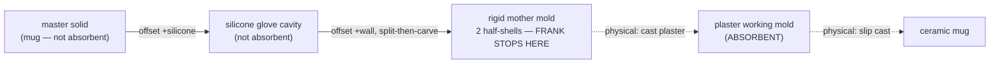
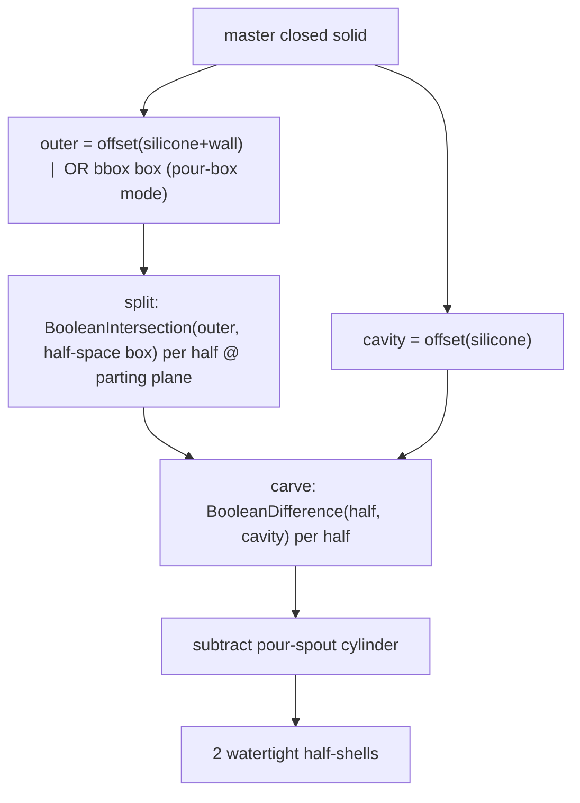
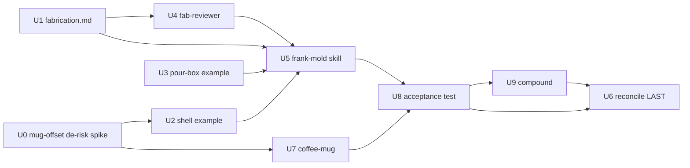

# feat: /frank-mold (silicone mother molds) + a slip-cast coffee-mug acceptance test

**Target repo:** `frank` (`~/Documents/projects/frank`). All paths frank-relative.

## Summary

Two phases. **Phase A** authors `/frank-mold` — a skill that generates 3D-printable **silicone mother molds** off a master object — plus the deferred 7th agent `frank-fabrication-reviewer` (the moldability lens), the now-authored `knowledge/fabrication.md` canon (mold + slip-cast track), and two golden examples (a conforming-shell mold and a pour-box mold). **Phase B** is the acceptance test: model a **parametric handled coffee mug** and generate its **2-part mother mold split through the handle** via `/frank-mold`, proving the canon + skill + reviewer + examples all wire together on a real, demanding part (a handle is a textbook undercut).

The split-then-carve pipeline was **proven live on a *convex* master** this session (`master → OffsetSurface(create_solid=False)` to a **cavity** solid (master + silicone) and an **outer** solid (master + silicone + shell wall) → split the outer into half-blocks on the parting plane via `BooleanIntersection` with half-space boxes → `BooleanDifference` the cavity out of each half → subtract a pour spout; each half a watertight solid). It is **UNPROVEN on a hollow handled mug** — a materially harder offset (see Risk 1), which **U0 de-risks first** on the real master before any mold example is authored.

**Critical correction (from review):** the mold master is a **SOLID exterior positive** of the mug — *not* a hollow cup. Offsetting a hollow brep pushes the *inner* cavity wall outward and self-intersects across the interior; a slip-cast master is a solid pattern, and the mug's hollow is formed by drain-casting downstream (out of scope). So U7 revolves the **outer** silhouette as a *capped solid* and unions the handle — making the offset robust (a convex-ish solid, like the proven ovoid).

**User decisions (2026-06-01):** build `/frank-mold` then use it; **both** output modes (conforming silicone-glove shell + pour box); **user-specified** parting plane; the mug ships **with a handle**, mold **split through the handle** (the handle bisects on the parting plane and releases). Target tool: **Rhino** (connected, pipeline proven there on a convex master).

> **A note on "tests":** frank's skills/agents are markdown instruction files and its generators run against a live MCP with no unit-test runner. Throughout, **Test scenarios** are **behavioral / geometric verification assertions** (a stated input → action → observable outcome: a watertight solid, the foreign-layer invariant holding, the handle bisecting). The real integration test is **U8** (generate the mug's mother mold live).

---

## Problem Frame

Building silicone mother molds by hand (laying up plaster/fiberglass shells over a silicone glove) is slow and imprecise. A printed mother mold is a massive speed-up for reproducing slip-cast plaster molds — but only if the geometry is right: a wrong parting plane or a missed undercut yields an unmoldable shell and wasted print + silicone. `frank` is the natural home for this (parametric, idempotent, fabrication-output geometry), and it's the moment to activate the deferred fabrication side (`fabrication.md` + `frank-fabrication-reviewer`). The coffee mug — a revolved body plus a handle (the one symmetry-breaker, an undercut) — is the ideal acceptance test: it exercises exactly the hard case (`/frank-mold`'s undercut/parting logic) on something Rob would actually slip-cast.

---

## Requirements

- **R1.** `/frank-mold` loads as a slash command and generates a printable mother mold off a master closed solid, in **both** modes — conforming silicone-glove **shell** and simple **pour box** — with a **user-specified** parting plane.
- **R2.** Generators are **idempotent, scope-isolated** (own one named layer), **re-runnable**, driven by a named parameter block — the frank-build contract; the **foreign-layer object-count invariant** holds every run.
- **R3.** The mold geometry uses the **proven split-then-carve** pipeline; each output half is a **watertight solid**. The three canon gotchas are encoded as guards (can't boolean two nested non-touching solids; `OffsetSurface(create_solid=True)` fails on a closed polysurface; offsetting two shells jams on the coincident master face).
- **R4.** `frank-fabrication-reviewer` ships as the 7th agent — a Template-A reviewer in the **fabrication lane** performing six moldability checks (undercut-vs-parting/fingernail-test, wall thickness, vents/air-traps, registration, bed-fit, draft-sign-never-negative), sharing the pinned JSON/RUN_ID contract.
- **R5.** `knowledge/fabrication.md` is **authored** (mold + slip-cast track, cited) — no longer a stub — and is STOP-gate-loaded by `/frank-mold` and the reviewer.
- **R6.** A **parametric handled coffee mug** is modeled (`examples/rhino/coffee-mug.py`) as a watertight master solid, built on +X with the handle symmetric about `y=0`.
- **R7.** **Acceptance test:** `/frank-mold` produces the mug's **2-part mother mold split on the XZ plane (through the handle)** — two watertight half-shells, the handle bisected and releasing.
- **R8.** Docs/manifest reconcile to the shipped surface (**6 skills, 7 agents**, `fabrication.md` authored).

---

## Scope Boundaries

- **In scope:** the `/frank-mold` skill (both modes, user-specified, axis-aligned parting), the fabrication reviewer + canon, two mold golden examples, the handled mug, and the live mold acceptance test.
- **`/frank-mold` stops at the rigid mother mold.** It produces the durable master → glove-cavity → rigid-shell tower; the **consumable plaster working mold** (the absorbent production tool) and the slip cast itself are *physical* steps, not modeled. State this explicitly in the skill.
- Parting plane is **axis-aligned** (world XZ/YZ) for v1.

### Deferred to Follow-Up Work

- **Vent risers** modeled into the mold (rim / handle-apex / loop-void high points) — v1 leaves venting as a fabrication-reviewer advisory + canon guidance (`fill-low, vent-high`); a `vents` knob is a natural follow-on.
- **Registration keys / keel groove** modeled into the shell halves (ball-and-socket booleans) — v1 documents them in canon and the reviewer flags their absence; modeling them is a later geometry addition.
- **Arbitrary (non-axis-aligned) parting plane** — a documented extension of the half-space-box cutters.
- **Houdini track** for `/frank-mold` (VDB offset is more robust for organic masters) — Rhino first.

---

## Context & Research

*(From the `frank-mold-mug-research` workflow + the live proof this session. Structural exemplar: `docs/plans/2026-06-01-001-feat-frank-skill-spine-plan.md`.)*

### The proven mold pipeline (live, this session)

`master → OffsetSurface(create_solid=False)` → **cavity** (master + `silicone_thickness`) and **outer** (master + `silicone_thickness + shell_wall`), both closed solids → **split-then-carve**: `BooleanIntersection(outer, half_space_box)` per half on the parting plane, then `BooleanDifference(half, cavity)` per half → subtract a pour-spout `AddCylinder`. Both halves verified `IsObjectSolid`. **Why split-then-carve is mandatory:** Rhino cannot difference two nested non-touching solids into a shell (returns nothing, even RhinoCommon `Brep.CreateBooleanDifference`); `OffsetSurface(create_solid=True)` fails on a closed polysurface; differencing two offset *shells* jams on the coincident master face.

### Mug modeling recipe (live-verified primitives)

A named `P` block (`mug_height`, `wall_thickness`, `rim_dia`, `base_dia`, `base_thickness`, `handle_height`, `handle_projection`, `handle_thickness`, `handle_z_offset`, `fillet_radius`, `build_handle`, `do_fillet`) → 5 steps: (1) **revolve a CLOSED XZ profile** (`rs.AddRevSrf(profile, ((0,0,0),(0,0,1)), 0, 360)` — axis is a **point-pair line**, not a vector; cap; assert `IsObjectSolid`); (2) **handle** = `rs.AddPipe` (returns a list, `cap=1`) on an interp rail whose endpoints **tuck ~2 mm into the wall** (a kiss → empty union); (3) `rs.BooleanUnion([body,handle])` (returns a list, expect 1, assert solid); (4) **fillet via RhinoCommon** — **`FilletEdges` is absent from this rhinoscriptsyntax build**; use `Rhino.Geometry.Brep.CreateFilletEdges(...)`, **non-fatal** (fall back to the unfilleted watertight mug); (5) handoff the mug as the master solid. Three encoded guards: closed profile, rail tuck-in, fillet non-fatal.

### Handle parting strategy (grounded)

Parting plane = **world XZ (`y=0`)**, the vertical plane through the mug axis *and* the handle. The body is a surface of revolution (any axial plane → zero-undercut side-pulls); the handle is the only symmetry-breaker; bisecting it splits the loop into two open-faced channels that each release. Holds **only** while the handle is symmetric about the parting plane (round-but-in-plane releases; round-*and-out-of-plane* is an undercut → 3rd piece or **cast-handle-separately**, the canonical ceramics escape hatch). Our base is a simple taper (no recessed foot → no drop-out spare needed → 2-part stands).

### Institutional learnings

`docs/solutions/` (6 learnings) — esp. the offset/boolean gotchas implicit in the proven pipeline. The `FilletEdges`-absent finding is a fresh `frank-compound` candidate (U9). Drop the spine's `skills/*/references/.gitkeep` anti-pattern (the spine review's P3) — `/frank-mold` loads the **plugin-level** `references/` + `knowledge/`, no skill-local dir.

---

## Key Technical Decisions

- **Split-then-carve, always** (R3) — the only robust shell construction in Rhino; documented in `fabrication.md` §8 (geometry and craft agree: a shell is one rigid piece with one release direction, so split first, carve second).
- **Both modes share one primitive set.** Conforming shell (`mother-mold-shell.py`) and pour box (`pour-box-mold.py`) differ only in the *outer* solid (offset-conforming vs bbox-box); both use the same split-then-carve + pour-spout core.
- **Master = a watertight SOLID EXTERIOR positive, acquired by layer name.** `/frank-mold` takes the single closed solid on a named master layer (the mug's `Coffee-Mug` layer), asserts `IsObjectSolid`, and **halts** otherwise (the offset silently fails on an open/hollow master). Not a hollow cup — see the Summary correction.
- **`/frank-review` is the SOLE reviewer orchestrator and RUN_ID source** (matching the spine's R9/U10). `/frank-mold` does **not** generate `RUN_ID` or dispatch `frank-fabrication-reviewer` — at the end it *suggests* `/frank-review` for a fabrication pass. `frank-fabrication-reviewer` reads `RUN_ID` from its payload and writes `/tmp/frank/frank-review/$RUN_ID/frank-fabrication-reviewer.json` like its siblings; it is the moldability lane (no MCP grant). Draft check is slip-cast-aware: for the modeled **rigid-shell-off-silicone-glove** release, draft-sign is *advisory* (silicone flexes); **negative draft** is carried forward as an advisory about the downstream plaster→ceramic release (the master shape determines it even though the plaster mold isn't modeled). Don't over-apply general mold-making's 1–3° minimum.
- **Undercut check is a per-surface draft-sign test, not just parting-symmetry.** Symmetry-about-the-plane is a fast pre-filter; the real test flags any cavity surface whose normal has a negative component along a half's pull direction (±parting-normal), over the *whole* master. The **handle-to-body junction tongue** and the **rim lip** are named cases the reviewer must clear (symmetry alone green-lights them).
- **Minimal registration keys ARE in v1; vents are deferred.** Each conforming-shell / pour-box half gets a simple pin-and-socket key pair (a Boolean cone/cylinder per half) so the halves align repeatably — without keys a two-shell mold has no repeatable alignment and is a geometry prototype, not the production tool the speed-up promises. Vents (rim / handle-apex / loop high points) stay reviewer-advisory + canon-documented (a `fill-low, vent-high` knob is a follow-on).
- **Fillet is a non-fatal castability nicety** — never let a failed `CreateFilletEdges` kill an otherwise-watertight mug.
- **Reconcile docs LAST (U6)** against `ls agents/ | wc -l` / `ls skills/`, mirroring the spine's U12.

---

## Output Structure

```
frank/
  knowledge/fabrication.md                 # U1 — authored (was stub)
  examples/rhino/
    mother-mold-shell.py                    # U2 — golden conforming-shell mold
    pour-box-mold.py                        # U3 — pour-box mold
    coffee-mug.py                           # U7 — parametric handled mug master
  agents/frank-fabrication-reviewer.agent.md # U4 — the 7th agent
  skills/frank-mold/SKILL.md                # U5 — the new skill
  README.md  docs/plan.md  .claude-plugin/plugin.json  CHANGELOG.md  # U6 reconcile
  docs/solutions/2026-06-01_rhino-filletedges-absent-use-rhinocommon.md  # U9 (likely)
```

---

## High-Level Technical Design

> *Directional guidance for review, not implementation spec.*

**The reproduction chain (what `/frank-mold` produces vs. what's physical):**



**Split-then-carve (the proven core, both modes):**



**Unit dependency graph:**



---

## Implementation Units

## Phase A — Author `/frank-mold`

### U0. De-risk spike — offset the real mug-exterior solid (gate; run first)

- **Goal:** Confirm the (convex-proven) split-then-carve pipeline survives the *actual* master — a **solid exterior** mug with a handle — before authoring the mold examples/skill. The offset of the real master is the one unproven step.
- **Requirements:** R3, R6.
- **Dependencies:** none. **Runs first.**
- **Files:** none committed (a live-MCP spike; findings feed U2/U5/U7; any gotcha → U9).
- **Approach:** Build a quick **solid-exterior** mug master live in Rhino (revolve the outer silhouette as a *capped solid*, union a round handle) and run `OffsetSurface(create_solid=False)` at the planned `silicone_thickness` → confirm `cavity` and `outer` are both `IsObjectSolid` with no self-intersection at the handle root or rim. If it self-intersects, capture the exact failure and the cure (smaller offset, offset only the outer faces, or pour-box fallback) and fold it into U2/U5/U7. Gate-first discipline (mirrors the spine's U0) — do not let U8 be first contact with the hard offset.
- **Test scenarios:** *(geometric)* `OffsetSurface` on the solid mug-exterior yields `IsObjectSolid` cavity + outer at the target `silicone_thickness`; any failure mode is captured with its cure.
- **Verification:** A clean cavity+outer off the real mug-exterior master, **or** a documented cure with U2/U5/U7 adjusted.
- **Execution note:** Live-MCP spike, not authoring — it de-risks the load-bearing geometry up front.

### U1. Author `knowledge/fabrication.md` canon (mold / slip-cast track)

- **Goal:** Promote the `fabrication.md` stub to authored, cited canon for the mold + slip-cast track. STOP-gate-loaded by U4 and U5, so it lands first.
- **Requirements:** R5.
- **Dependencies:** none.
- **Files:** `knowledge/fabrication.md`.
- **Approach:** Replace the five stub sections (keep the top Layer-1 framing + extend the Cross-References). Drop the "Status: stub" banner. Sections per the research outline: §0 a parting plane is a release direction; §1 parting-line placement for a handled mug (vertical-through-handle; when it forces 3+ parts / cast-separately); §2 draft & undercuts (fingernail test; **zero draft OK for slip casting, never negative**); §3 vents/air-traps (the three mug high points; fill-low-vent-high); §4 registration (two distinct jobs; tapered keys; flat keys slide); §5 thickness rules (¼" silicone baseline; ¼–⅜" printed wall); §6 pour-spout/sprue orientation; §7 the full chain (only plaster is absorbent); §8 why split-then-carve is mandatory (geometry + craft agree). Inline citations (Smooth-On, Polytek, Make:, Ceramic Arts Network, Ceramic Resource, Digitalfire, etc.).
- **Patterns to follow:** `knowledge/parametric-scripting.md` / `verification.md` (authored-canon structure + cited Sources block).
- **Test scenarios:** *(behavioral)* A STOP-gate canon load from U5/U4 resolves to real mold guidance; the draft section explicitly states zero-draft-OK-never-negative (so the reviewer doesn't over-flag); §8 names the three split-then-carve gotchas.
- **Verification:** No "stub" banner remains; all 9 sections present with citations; Cross-References extended to the new skill/agent/examples.

### U2. `examples/rhino/mother-mold-shell.py` — golden conforming-shell mold

- **Goal:** Encode the proven split-then-carve pipeline (conforming silicone-shell mode) as the golden generator `/frank-mold` emits.
- **Requirements:** R1, R2, R3.
- **Dependencies:** U0 (the offset must be confirmed on a real solid master first).
- **Files:** `examples/rhino/mother-mold-shell.py`.
- **Approach:** Mirror `examples/rhino/spiral-ribbon-sculpture.py` discipline (one named `P` block, three idempotent layer helpers, foreign-layer object-count invariant, guards-that-WARN, `try/finally` transient cleanup). Take the **solid exterior** master → `OffsetSurface(create_solid=False)` (+ cap/join) → **cavity** (master + silicone) and **outer** (master + silicone + wall), each asserted `IsObjectSolid` → **split-then-carve** on the user parting plane: two `AddBox` half-space cutters, each spanning `[min−m, max+m]` in the two non-parting axes and `[parting−ε, max+m]` / mirror in the parting axis, with `m = max(0.1·max_bbox_dim, 5mm)` (a named knob, not magic) and a tiny `ε` overlap past the parting plane so the cutters don't share a coincident face (the coincident-face boolean trap); `BooleanIntersection(outer, cutter)` per half; `BooleanDifference(half, cavity)` per half → subtract pour-spout `AddCylinder` → **add one pin-and-socket registration key per half** (a Boolean cone/cylinder union on one half + matching socket difference on the other, on the parting flange) so the halves align repeatably. Encode the three canon gotchas as header comments + guards. Owns one layer (e.g. `Mother-Mold`).
- **Patterns to follow:** the proven session script; the spiral golden example.
- **Test scenarios:** *(geometric)* Given a watertight master, both halves return `IsObjectSolid == True`; re-running leaves foreign layers' counts identical and the owned layer rebuilt (not doubled); a master that's *not* a closed solid trips a WARN, not a crash; half-space boxes sized from bbox+margin yield complete (un-truncated) halves.
- **Verification:** Two watertight half-shells + foreign invariant printed OK; no magic numbers in the body.

### U3. `examples/rhino/pour-box-mold.py` — pour-box mold (second mode)

- **Goal:** The rigid-block alternative — a 2-part pour box around the master.
- **Requirements:** R1, R2, R3.
- **Dependencies:** U0.
- **Files:** `examples/rhino/pour-box-mold.py`.
- **Approach:** Same pattern discipline as U2; the *outer* is a **rectangular box** sized to the master bbox + `pour_margin` (a named knob, e.g. `max(20mm, 0.15·max_bbox_dim)` — not a conforming offset); the cavity is still `master + silicone_thickness`. Split-then-carve the box on the user parting plane (same `ε`-overlap cutter treatment as U2), carve the cavity from each half, subtract a pour spout, **add the same pin-and-socket registration key per half**. Demonstrates the both-modes requirement; shares U2's primitives.
- **Patterns to follow:** U2.
- **Test scenarios:** *(geometric)* Both box halves `IsObjectSolid`; cavity carved open at the parting face; foreign invariant holds; box margin derived from bbox, not magic.
- **Verification:** Two solid box halves with the master cavity + pour spout.

### U4. `agents/frank-fabrication-reviewer.agent.md` — the 7th agent (fabrication lane)

- **Goal:** Author the deferred moldability reviewer.
- **Requirements:** R4.
- **Dependencies:** U1.
- **Files:** `agents/frank-fabrication-reviewer.agent.md`.
- **Approach:** Template-A Structured Reviewer (read `agents/frank-geometry-reviewer.agent.md` for the exact envelope). Frontmatter `name: frank-fabrication-reviewer`, `model: inherit`, `tools: Read, Grep, Glob, Bash, Write` (**no MCP grant**). **Payload schema** (pinned — `/frank-review` writes `geometry_summary_path`, the dispatcher passes the rest): `{geometry_summary_path, RUN_ID, parting_plane, mode, master_layer, master_bbox, silicone_thickness, shell_wall_thickness, half_watertight:[bool,bool], intent}`. Body: `## What you're hunting for` = the six checks. **(1) Undercut = a per-surface draft-sign test, not just parting-symmetry:** for each half's pull direction (±parting-normal), flag any cavity surface whose normal has a negative component along the pull — evaluated over the **whole** master; symmetry-about-the-plane is only a fast pre-filter. **Named cases the reviewer must clear:** the **handle-to-body junction tongue** (a y=0-symmetric handle whose loop closes toward the body still traps the shell) and the **rim lip** (the re-entrant inner edge). (2) wall thickness, (3) vents/air-traps, (4) registration (flag missing/flat keys), (5) bed-fit, (6) **draft-sign** — *advisory* for the modeled rigid-shell-off-silicone-glove release (silicone flexes), **negative draft** carried forward as an advisory about the downstream plaster→ceramic release (suppress zero/low-positive draft — don't apply general mold-making's 1–3° minimum). `## Confidence calibration` 100/75/50/25-suppress; `## What you don't flag` (defers visual to `frank-silhouette-critic`, topology validity to `frank-geometry-reviewer` *unless* it's a moldability blocker); `## Output format` = JSON-only `{reviewer, findings, residual_risks, testing_gaps}`, `lane: "fabrication"`, written to `/tmp/frank/frank-review/$RUN_ID/frank-fabrication-reviewer.json` (`RUN_ID` **read from payload**, never generated). Grounds findings in `knowledge/fabrication.md`.
- **Patterns to follow:** `frank-geometry-reviewer.agent.md` (Template A + the pinned contract).
- **Test scenarios:** *(behavioral)* Given a round handle symmetric about the parting plane, it does **not** false-positive an undercut; given an out-of-plane handle, it flags the undercut + recommends cast-separately; it does **not** flag zero-draft on a slip-cast wall; it emits JSON-only with `lane:"fabrication"` to the RUN_ID path; declares no `mcp__*` tool.
- **Verification:** Frontmatter tools = `Read, Grep, Glob, Bash, Write` (no MCP); envelope matches the sibling reviewers; draft check is slip-cast-aware.

### U5. `skills/frank-mold/SKILL.md` — the `/frank-mold` skill (both modes, user-specified parting)

- **Goal:** Author the skill.
- **Requirements:** R1, R2, R3, R5.
- **Dependencies:** U1, U2, U3, U4.
- **Files:** `skills/frank-mold/SKILL.md`.
- **Approach:** Follow `skills/frank-build/SKILL.md` structure (copy `## Interaction Method` verbatim; `## Core Principles`, `## When to Use`, a quality bar, phased `## Workflow`). **Phase 0 — detect + acquire master:** detect the MCP family; **acquire the master by layer name** (a `master_layer` argument; assert it holds **exactly one** closed solid; `IsObjectSolid` else **halt** — the offset silently fails on an open/hollow master). **Phase 1 — ask:** `AskUserQuestion` single-select for the **parting plane** — `XZ — vertical, through the handle axis` (cutter normal = **Y**, split into ±Y) / `YZ — vertical, across the front` (normal = **X**) / `XY — horizontal` (normal = **Z**) — and the **mode** (conforming shell / pour box / both). **Phase 2 — load:** STOP-gate `knowledge/fabrication.md` + the `references/rhino-mcp.md` build/capture policy + the three split-then-carve gotchas. **Phase 3 — emit + guard recovery:** emit the split-then-carve generator per mode (U2/U3 patterns), gotchas as guards; after `OffsetSurface` + cap/join, **detect a self-intersecting conforming offset via `IsObjectSolid` on cavity+outer** — on failure, `AskUserQuestion` (fixed text: *"The conforming offset self-intersects (handle root / interior) — switch to pour-box mode, or halt to adjust the master? [1 pour-box / 2 halt]"*); **never silently downgrade**. **Phase 4 — run + verify:** `execute_rhinoscript_python_code`; confirm the foreign-layer invariant + each half `IsObjectSolid`; **write a geometry_summary file** (bbox, per-half watertightness, parting plane, thicknesses) for a later fabrication pass. **Phase 5 — hand off (no dispatch):** `/frank-mold` does **not** generate `RUN_ID` or dispatch `frank-fabrication-reviewer`; it **suggests `/frank-review`** (the sole reviewer orchestrator + RUN_ID source) for the moldability pass, and offers `/frank-compound`. State the scope boundary: `/frank-mold` stops at the rigid mother mold (plaster is physical). *(No `skills/frank-mold/references/.gitkeep` — loads plugin-level refs.)*
- **Patterns to follow:** `skills/frank-build/SKILL.md`; the proven pipeline.
- **Test scenarios:** *(behavioral)* On a non-solid master, halts with the connection/solid guidance (no offset attempt); asks parting + mode before emitting; never calls a banned op; the emitted generator follows split-then-carve; a self-intersecting offset triggers WARN + question, not a silent mode change.
- **Verification:** Loads as `/frank-mold`; acquires the master by layer name + asserts solid; STOP-gates the canon + gotchas; on offset self-intersection asks (pour-box / halt), never silent-downgrades; produces watertight half-shells on a valid master; **suggests `/frank-review`** (does not dispatch the reviewer itself). *(No `skills/frank-mold/references/.gitkeep` — loads plugin-level refs.)*

### U6. Reconcile README + manifest + plan to the shipped surface

- **Goal:** Docs reflect 6 skills / 7 agents / authored `fabrication.md`.
- **Requirements:** R8.
- **Dependencies:** U8, U9 (reconcile **LAST**, against the post-acceptance disk surface — mirrors the spine's U12; runs after the spine's U12, bumping the cumulative state from 6 agents / 5 skills to 7 / 6).
- **Files:** `README.md`, `docs/plan.md`, `.claude-plugin/plugin.json`, `CHANGELOG.md`.
- **Approach:** README: 5→6 skills (add `/frank-mold` to the table), 6→7 agents (add `frank-fabrication-reviewer`, drop the "six agents ship today / planned alongside" caveat), flip `fabrication.md` from 🚧 stub to ✅ authored. `docs/plan.md`: mark M5 complete, R3 → 7 agents, update the file-tree comments. `plugin.json`: bump 0.2.0 → 0.3.0, add `mold`/`slip-casting` keywords, confirm no registration keys needed (directory convention — verify against CE). `CHANGELOG.md`: a 0.3.0 entry.
- **Patterns to follow:** the spine plan's U12.
- **Test scenarios:** *(behavioral)* README agent count == `ls agents/ | wc -l` (7); skill count == `ls skills/ | wc -l` (6); no doc claims a component that doesn't ship.
- **Verification:** Counts match disk; version bumped; canon-status row updated.

## Phase B — Model the mug and prove the mold (acceptance test)

### U7. Model the parametric handled coffee mug (`examples/rhino/coffee-mug.py`)

- **Goal:** Build the watertight handled-mug **solid exterior positive** that feeds the mold (the mold pattern, not a hollow cup).
- **Requirements:** R6.
- **Dependencies:** U0 (the de-risk confirms the mug-exterior offsets cleanly).
- **Files:** `examples/rhino/coffee-mug.py`.
- **Approach:** Author + build per the mug recipe: the named `P` block; (1) revolve the **outer silhouette as a capped SOLID** positive — **not** a hollow cup (the mold master is a solid exterior; the mug's hollow is formed downstream by drain-casting, out of scope) — via `AddRevSrf` with a **point-pair axis**, cap the top, assert `IsObjectSolid`; (2) `AddPipe` a round handle on a tucked-in interp rail (`cap=1`, take `[0]`); (3) `BooleanUnion(body, handle)` → one solid (`[0]`, assert solid); (4) **best-effort** seam fillet via RhinoCommon `Brep.CreateFilletEdges` (FilletEdges absent in this build), selecting seam edges as those whose two adjacent faces came from **different source breps** (the union seam) — **non-fatal**: it often falls through to the unfilleted watertight mug, which fully satisfies the acceptance test; (5) handoff as the master. Same pattern discipline as the golden examples (one `P` block, three layer helpers owning `Coffee-Mug`, foreign-layer invariant, guards: solid-profile / rail-tuck-in / fillet-non-fatal, `try/finally`). Built on +X, handle symmetric about `y=0`. Confirm signatures via `frank-rhino-docs-researcher` before emit (frank-build Phase 1).
- **Patterns to follow:** the golden examples; the mug recipe in Context & Research.
- **Test scenarios:** *(geometric)* The body is `IsObjectSolid` before the handle; the union returns exactly one solid (`len(joined)==1`); a kissing (non-tucked) rail trips the union-empty WARN; a failed fillet falls back to a watertight unfilleted mug (still `IsObjectSolid`); the mug is symmetric about `y=0`; foreign invariant holds.
- **Verification:** A single watertight handled-mug solid on the `Coffee-Mug` layer; re-runnable.

### U8. Acceptance test — generate the mug's 2-part mother mold via `/frank-mold`

- **Goal:** Prove the whole feature end-to-end on the mug.
- **Requirements:** R1, R3, R7.
- **Dependencies:** U7, U5.
- **Files:** `examples/rhino/coffee-mug.py` *(input)*, `docs/solutions/.gitkeep` *(any surfaced learning lands via U9)*.
- **Approach:** Run `/frank-mold` on the U7 mug master (the solid on the `Coffee-Mug` layer), user-specified parting = world **XZ (`y=0`, through the handle)**, in **both modes** (conforming-shell *and* pour-box — each a layer clear-and-rebuild, exercising R1's both-modes). Then run **`/frank-review`** for the moldability pass — it generates RUN_ID and dispatches `frank-fabrication-reviewer` (per-surface draft-sign over the whole master incl. the **handle-junction tongue** + **rim lip**, vents at rim/handle-apex, registration). `/frank-mold` itself does **not** dispatch. This is **execution/validation** (live Rhino MCP), not authoring.
- **Patterns to follow:** this session's spiral build + the proven mold proof; the frank-build/review loop.
- **Test scenarios:** *(geometric)* Each mother-mold half is `IsObjectSolid`; the handle is **bisected** by `y=0` (each half carries half the handle); foreign-layer invariant holds; split-then-carve runs clean; the fabrication reviewer flags vents (advisory) but **not** the in-plane round handle as a blocker; the pour spout opens the cavity.
- **Verification:** Two watertight half-shells of the mug's mother mold, handle split through, presented for human acceptance.
- **Execution note:** Live validation closing the loop — the integration test for U1–U7.

### U9. Compound any new gotcha from the mug-and-mold build

- **Goal:** Capture fresh learnings.
- **Requirements:** R5 (compounding memory).
- **Dependencies:** U8.
- **Files:** `docs/solutions/2026-06-01_rhino-filletedges-absent-use-rhinocommon.md` *(likely)*, plus any others surfaced.
- **Approach:** Via `/frank-compound`, write a learning for any new gotcha — strong candidates: **`FilletEdges` absent → use RhinoCommon `Brep.CreateFilletEdges`, fillet non-fatal**; the **handle-rail-must-tuck-in** union-overlap gotcha; **closed-revolve-profile-or-nothing-downstream**; any offset-robustness issue on a hollow handled mug. Existing frontmatter schema + Symptom→Root cause→Fix→Verified facts→Cross-References; cross-link `references/rhino-mcp.md`, `knowledge/fabrication.md`, and the examples. Record "none found" if clean.
- **Patterns to follow:** the existing `docs/solutions/` learnings.
- **Test scenarios:** *(behavioral)* Each learning parses against the schema; cross-references resolve; `frank-learnings-researcher` can retrieve it.
- **Verification:** At least the FilletEdges learning written (or "none found" recorded).

---

## Risks & Mitigation

1. **Offset robustness at the handle root (residual, after the solid-master fix + U0 gate).** Using a **solid exterior** master (not a hollow cup) removes the original trap — there's no inner cavity wall to push outward and self-intersect — and **U0 de-risks the real-mug offset before any example/skill is authored.** The residual risk is the offset self-intersecting at the **handle root** (a concave saddle) or failing to cap into a clean cavity/outer. *Mitigation:* the U0 spike; assert `IsObjectSolid` on cavity + outer before split-then-carve; on failure, the U5 Phase-3 detection → WARN + AskUserQuestion (pour-box / halt), never silent.
2. **Handle union returns nothing.** A kissing rail (not tucked into the wall) → empty `BooleanUnion` → handle floats free → master isn't one solid → every downstream offset silently breaks. *Mitigation:* tuck rail endpoints ~2 mm in (recipe); assert `len(joined)==1` + `IsObjectSolid`; WARN-and-name.
3. **Fillet failure / absent `FilletEdges`.** `CreateFilletEdges` returns empty on a tangent join, too-large radius (self-intersection), or split breps (`len>1`). *Mitigation:* fillet is **non-fatal** — fall back to the unfilleted watertight mug; cap radius at `min(0.25·handle_thickness, wall_thickness)`; compound (U9).
4. **Undercut-vs-parting misdetection on the round handle.** Round-*and-in-plane* releases; round-*and-out-of-plane* is an undercut. The reviewer must distinguish geometrically (symmetric about the parting plane?), not by section shape. *Mitigation:* ground the undercut check in the parting spec, not "is it round"; recommend cast-separately only for the genuine out-of-plane case.
5. **Vents unmodeled.** Watertight ≠ castable: the rim, handle apex, and loop-void top trap air. *Mitigation:* the reviewer flags missing vents; canon §3 states fill-low-vent-high; a `vents` knob is deferred (open question).
6. **Half-space box sizing.** Cutters must straddle `y=0` and exceed the outer bbox in the other axes or the half is truncated. *Mitigation:* size from the outer bbox + margin (derived); assert each half is a watertight solid post-intersection.
7. **Doc reconciliation drift.** Adding a skill + agent + authored canon changes all the counts. *Mitigation:* reconcile **last** (U6) against `ls` reality.

---

## Open Questions

### Resolved during planning
- *Scope?* → **Build `/frank-mold` then use it** (the mug is the acceptance test). *(Rob)*
- *Modes?* → **Both** (conforming shell + pour box). *(Rob)*
- *Parting?* → **User-specified**, axis-aligned for v1; the mug uses world XZ through the handle. *(Rob)*
- *The mug?* → **With a handle, mold split through the handle** (bisects + releases). *(Rob)*
- *Master shape?* → **Solid exterior positive** (not a hollow cup — fixes the offset self-intersection; correct slip-cast pattern). *(review)*
- *Reviewer dispatch / RUN_ID?* → **`/frank-review` only** generates RUN_ID + dispatches `frank-fabrication-reviewer`; `/frank-mold` suggests it (matches the spine R9/U10). *(review)*
- *Registration keys?* → **Minimal pin-and-socket key per half IS in v1** (an un-keyed mold has no repeatable alignment). **Vents** stay deferred (reviewer-advisory + canon). *(review)*
- *Self-intersecting offset?* → **WARN + AskUserQuestion** (pour-box / halt), detected via `IsObjectSolid` on cavity+outer; never silent. *(U5 Phase 3)*
- *Plaster working mold?* → **Out of scope** — frank stops at the rigid mother mold (plaster is physical).

### Deferred to implementation
- The fillet edge-selection (edges whose adjacent faces came from different source breps) — accept best-effort under the non-fatal fallback unless U7 shows it mis-selects.
- Exact offset/boolean behavior at the handle root on the real solid mug-exterior — **resolved empirically in U0** (the de-risk gate), then U7/U8.
- A `vents` knob (subtract risers at rim / handle-apex / loop high points) — a follow-on once the keyed acceptance test passes.
- Arbitrary (non-axis-aligned) parting plane — a documented extension of the half-space-box cutters (v1 is axis-aligned).

---

## Cross-References

- Proven pipeline + structural exemplar: `docs/plans/2026-06-01-001-feat-frank-skill-spine-plan.md`; this session's live mold proof.
- Canon authored here: `knowledge/fabrication.md`; siblings `knowledge/parametric-scripting.md`, `knowledge/verification.md`.
- Reference pack: `references/rhino-mcp.md`.
- Golden examples: `examples/rhino/spiral-ribbon-sculpture.py` (pattern), `examples/rhino/mother-mold-shell.py`, `examples/rhino/pour-box-mold.py`, `examples/rhino/coffee-mug.py`.
- Reviewers + contract: `agents/frank-fabrication-reviewer.agent.md`, `agents/frank-geometry-reviewer.agent.md`, `agents/frank-silhouette-critic.agent.md`.
